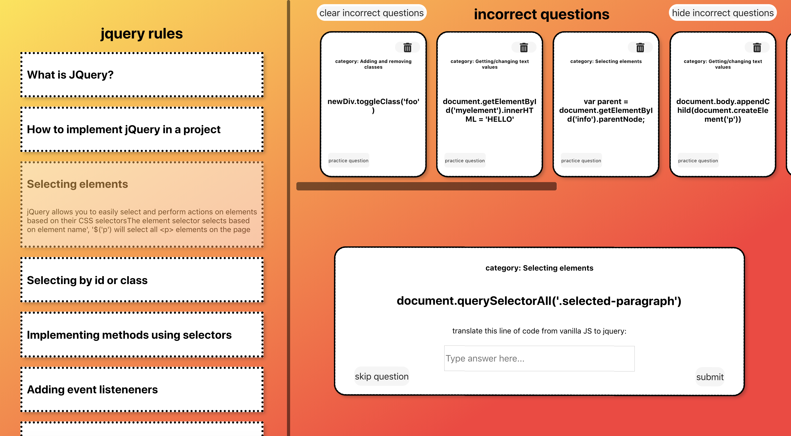

# Learn JQuery

### Abstract:

I created this app to act as a learning tool for students who are transitioning from coding in vanilla Javascript to learning JQuery. The user is able to view the basic rules of jQuery, practice translating lines of code from vanilla JS to JQuery, and keep track of questions they got incorrect to come back to later. It combines ReactJS, JSX, and SCSS as well as UI/UX Design to create a functional study app.

### Installation Instructions:

Open Your Terminal

Copy and paste the following lines below into your terminal:

`git clone https://github.com/colev1/learn-app.git`

`cd learn-app/`

`npm install`

`npm install node-sass`

`npm start`

### Technologies Used:

#### ReactJS

#### JSX

#### SASS/SCSS

### Design and Layout

##### Wireframe:

##### App:

