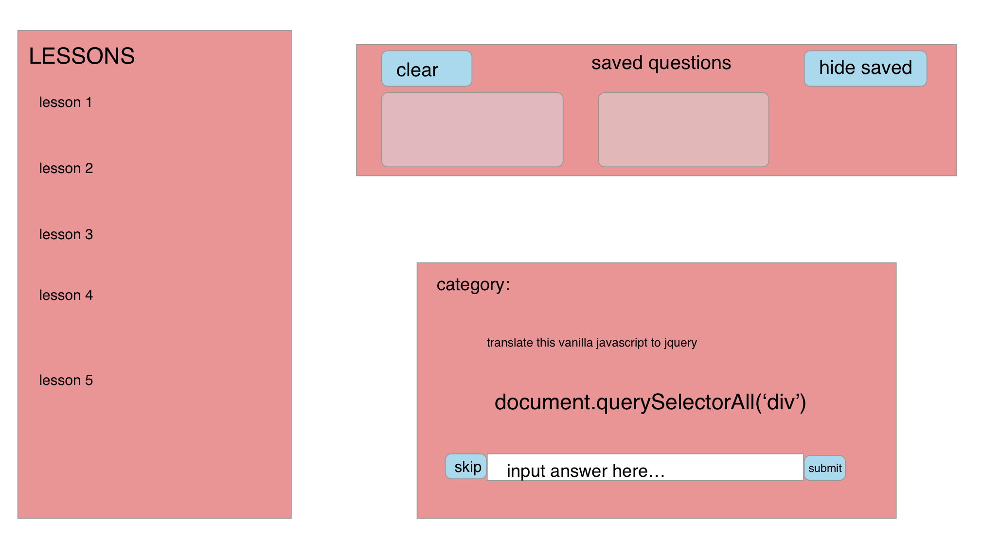

# Learn JQuery

### Abstract:

I created this app to act as a learning tool for students who are transitioning from coding in vanilla Javascript to learning JQuery. 

### Installation Instructions:

Open Your Terminal

Copy and paste the following lines below into your terminal:

`git clone https://github.com/colev1/learn-app.git`

`cd learn-app/`

`npm install`

`npm install node-sass`

`npm start`

### Project Background:

### Project Goals:

### Design and Layout

##### Our Wireframe:

##### Our App:

